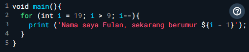
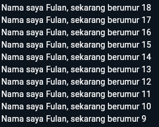

**Raden Ariq Resya Alauddine**
**2241720234 / TI - 3D**
---
**Jobsheet 2**

**Tugas Praktikum**

Soal 1

Modifikasilah kode pada baris 3 di VS Code atau Editor Code favorit Anda berikut ini agar mendapatkan keluaran (output) sesuai yang diminta!
- 
- 

Soal 2

Mengapa sangat penting untuk memahami bahasa pemrograman Dart sebelum kita menggunakan framework Flutter ? Jelaskan!

- karena Flutter dibangun sepenuhnya dengan Dart. Dart menyediakan dasar-dasar pemrograman berorientasi objek, pengelolaan state, serta pemrograman asinkron yang diperlukan untuk membangun aplikasi yang responsif. Selain itu, memahami Dart membantu dalam mengoptimalkan kinerja aplikasi, debugging, dan struktur widget yang efisien di Flutter. Tanpa pemahaman Dart, akan sulit untuk memanfaatkan penuh potensi Flutter dalam mengembangkan aplikasi.

Soal 3

Rangkumlah materi dari codelab ini menjadi poin-poin penting yang dapat Anda gunakan untuk membantu proses pengembangan aplikasi mobile menggunakan framework Flutter.

Dart adalah bahasa pemrograman modern yang menawarkan fitur-fitur unggul seperti alat produktivitas, garbage collection, anotasi tipe yang opsional, type-safe, dan portabilitas. Dart mendukung pengembangan aplikasi untuk web, mobile, dan desktop, serta menjadi bahasa dasar dari framework Flutter. Memahami Dart sangat penting untuk pengembangan aplikasi yang efektif menggunakan Flutter.

Di Dart, operator adalah metode khusus yang didefinisikan dalam class. Misalnya, penggunaan x == y setara dengan memanggil metode x.==(y). Semua tipe data di Dart adalah objek, berbeda dengan bahasa seperti Java yang memiliki tipe data primitif. Dart memungkinkan modifikasi operator sesuai kebutuhan, dan menyediakan operator aritmatika umum seperti + (penjumlahan) dan - (pengurangan).

Fungsi Utama (main):

Tipe Data Kembalian: void menunjukkan bahwa fungsi tidak mengembalikan nilai apapun. Nama Fungsi: main adalah nama fungsi utama yang dieksekusi pertama kali oleh Dart VM. Parameter: Tanda kurung kosong () menunjukkan fungsi ini tidak menerima parameter. Kurung Kurawal: {} digunakan untuk menentukan awal dan akhir blok kode fungsi. Fungsi vs Method:

Fungsi: Berada di luar class dan bisa dipanggil secara global. Contoh: main adalah fungsi global. Method: Terikat pada class dan memiliki akses ke instance class melalui keyword this.

